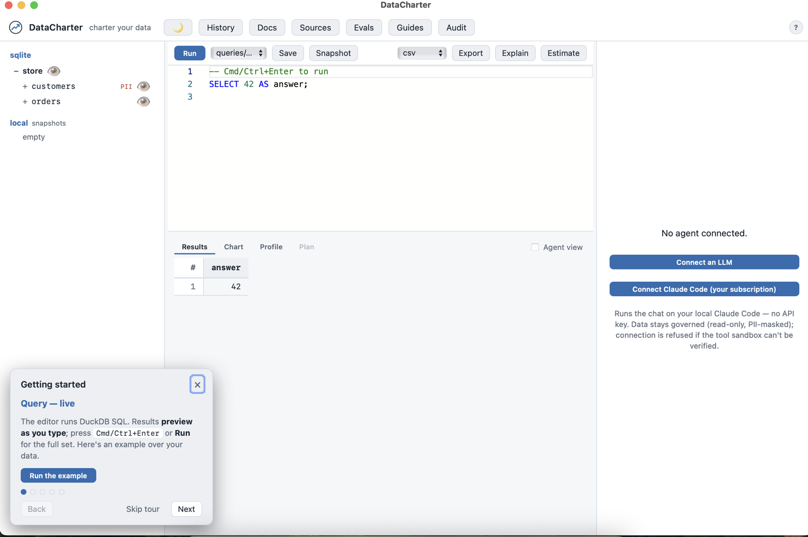
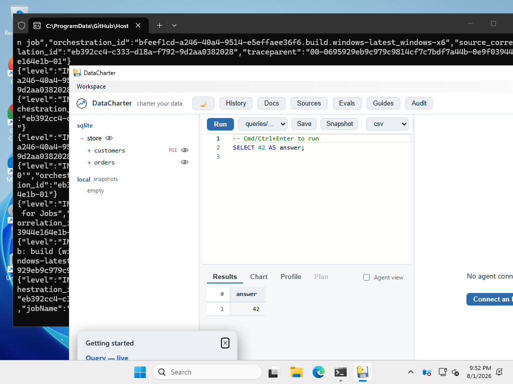

[Home](index.html) &middot; [Quick start](quickstart.html) &middot; [charter.yaml](charter-yaml.html) &middot; [Sources](sources.html) &middot; [Agent](agent.html) &middot; [Evals](evals.html) &middot; [Audit](audit.html) &middot; [Policies](policies.html) &middot; [CLI](cli.html) &middot; [MCP](mcp.html) &middot; [Desktop](desktop.html) &middot; [About](about.html) &middot; [FAQ](faq.html)

DataCharter as a real application: a native window over the same local server —
no terminal, no Python, no browser tab. Pick a workspace folder (or start with
the demo), and everything works exactly as it does under `datacharter serve`:
the explorer, guides, evals, audit, the governed agent surface.

*The Windows build, captured automatically on every release by CI.*

## Download (beta)

Grab the artifact for your platform from the
[latest release](https://github.com/datacharter/datacharter/releases/latest):

| Platform | File |
|---|---|
| macOS (Apple Silicon) | `DataCharter-<version>-macos-arm64.dmg` |
| Windows 10/11 | `DataCharter-<version>-windows-x64.zip` |

Intel Macs: use `brew install datacharter/tap/datacharter` or `uvx datacharter` —
GitHub retired free Intel macOS runners, so we don't ship an Intel build.

The app remembers your last workspace and keeps a **Workspace ▸ Recents** menu.
`brew install datacharter/tap/datacharter` and `uvx datacharter` remain the
primary, friction-free paths — the app is for the days you don't want a terminal.

## macOS: opening an unsigned beta

These builds are not yet signed with an Apple Developer ID, and macOS Sequoia
removed the old right-click→Open shortcut. First launch:

1. Double-click the app; macOS will refuse with "Apple could not verify…". Close it.
2. Open **System Settings → Privacy & Security**, scroll to the **Security** section.
3. You'll see *"DataCharter.app was blocked…"* — click **Open Anyway**, then
   confirm **Open** in the dialog.

That's a one-time step per version. (Signing/notarization is on the roadmap;
Homebrew and uvx installs have no such friction meanwhile.)

## Windows note

The `.exe` is unsigned, so SmartScreen may warn: click **More info → Run
anyway**. The Windows build is verified by automated smoke checks in CI but has
not yet had long human soak time — treat it as beta and report anything odd.

## How it works

The app is the same DataCharter you install from PyPI — a local FastAPI server
plus the web UI — wrapped in your OS's native webview (WKWebView on macOS,
WebView2 on Windows). It binds to localhost only, and every governance layer
(masking, row filters, read-only guard, audit, canaries) applies identically.
