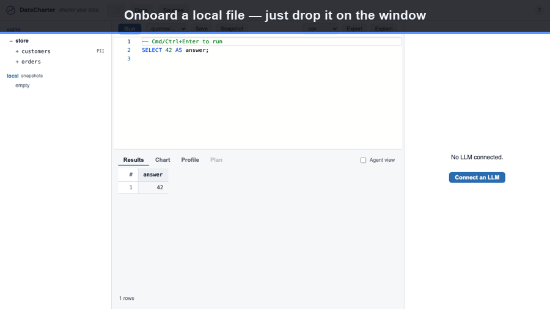

[Home](index.html) &middot; [Quick start](quickstart.html) &middot; [charter.yaml](charter-yaml.html) &middot; [Sources](sources.html) &middot; [Agent](agent.html) &middot; [Evals](evals.html) &middot; [Audit](audit.html) &middot; [Policies](policies.html) &middot; [CLI](cli.html) &middot; [MCP](mcp.html) &middot; [Desktop](desktop.html) &middot; [About](about.html) &middot; [FAQ](faq.html)

DataCharter is one Python package. `pip install datacharter` (or `uvx` for a
zero-install try) gives you the engine, the API, and the web UI in one process.
It requires Python 3.11 or newer.

## Try it in 60 seconds

No config, nothing installed globally:

```sh
uvx datacharter serve
# -> serves an ephemeral demo workspace on http://127.0.0.1:8321
```

This generates a tiny sample dataset and opens a local workspace. Browse the
source tree, run a query in the editor, switch to the Chart and Profile tabs,
and drag a CSV, Parquet, or JSON file onto the window to query it instantly.



## Start a real workspace

```sh
pip install datacharter                    # any OS (Python 3.11+)
# ...or on macOS with Homebrew:
brew install datacharter/tap/datacharter

datacharter init      # scaffold the workspace here
datacharter serve     # explore in your browser
```

`datacharter init` creates exactly this shape and nothing else:

```
charter.yaml     # your sources (safe to commit; no secrets)
queries/         # your SQL query library (*.sql)
.env.example     # credential names with placeholder values
.gitignore       # excludes .env and .datacharter/
```

Add `--demo` to include a generated demo dataset
(`datacharter init --demo`), or `--force` to overwrite an existing
`charter.yaml`.

## Add your first source

Edit `charter.yaml`. A local file needs only a type and a path:

```yaml
version: 1

sources:
  sales:
    type: csv
    path: data/sales.csv
```

A database uses `connection` for the non-secret shape and `credentials` for
`${NAME}` references:

```yaml
version: 1

sources:
  warehouse:
    type: postgres
    connection:
      host: db.internal.example
      database: analytics
      user: reader
    credentials:
      password: ${WAREHOUSE_PASSWORD}
    tables: [customers, orders]
```

Provide `WAREHOUSE_PASSWORD` through the environment, a local `.env`, or your OS
keyring. See the [secret resolution order](charter-yaml.html#secret-resolution-order)
for details. The full field list is in the
[charter.yaml reference](charter-yaml.html), and how each source type federates
is in the [sources matrix](sources.html).

### Store secrets in the OS keyring

To keep a credential out of both `charter.yaml` and `.env`, store it in your OS
keyring. The value is written by the keyring backend; only the `${NAME}`
reference ever lives in `charter.yaml`:

```sh
datacharter secrets set WAREHOUSE_PASSWORD   # prompts, no echo
datacharter secrets list                     # names only, never values
datacharter secrets rm WAREHOUSE_PASSWORD    # remove one
```

`set` prompts for the value without echoing it; pass `--value` to set it
non-interactively. `list` shows only the names stored this way (it does not list
environment or `.env` secrets).

## Query across sources

Every database table is exposed as a flat `<source>__<table>` view; a file
source is a relation named after the source. Joins across sources read like any
other SQL:

```sql
SELECT c.email, sum(o.total) AS spend
FROM warehouse__customers c
JOIN sales s ON s.customer_id = c.id
GROUP BY c.email
ORDER BY spend DESC
LIMIT 20;
```

Save a query from the editor into `queries/*.sql` to build a git-friendly query
library. Results are capped for display (with a truncation flag); use Export to
write the complete result set to CSV, Parquet, JSON, or XLSX.

## Turn on the agent (optional)

Ask questions in plain language. Bring an OpenAI-compatible endpoint or run fully
local:

```sh
# Bring your own endpoint:
export OPENAI_BASE_URL=...   # any OpenAI-compatible API
export OPENAI_API_KEY=...
datacharter serve

# Or fully local (no API key, no data leaves your machine):
datacharter serve --local    # uses Ollama, qwen3:8b by default
```

Or, if you have [Claude Code](https://claude.com/claude-code) installed and
signed in to a Claude plan, just `datacharter serve` and click **Connect Claude
Code** in the chat panel — the agent runs on your subscription, no API key
needed.

Whichever you choose, the agent only ever sees the data you allow: PII is masked
by default, adjustable per source, table, or column. Full detail is in
[Agent modes](agent.html). Everything except the chat panel works with no model
at all.

## Useful flags

| Flag | Effect |
| --- | --- |
| `--host` | Bind address. Defaults to `127.0.0.1` (localhost only). |
| `--port` | Port. Defaults to `8321`. |
| `--local` | Use a local Ollama model for the agent. |
| `--model` | Model name to use with `--local`. |
| `--no-spill` | Fail queries instead of spilling to disk (for regulated environments). |
| `--offline` | No-egress mode: disable the LLM agent and write a no-egress attestation. |

## More commands

Beyond `init` / `serve`, the CLI has commands for governance and exploration —
the full list is in the [CLI reference](cli.html):

- `datacharter query "<sql>"` — run a read-only query from the terminal (`--format table|csv|json`).
- `datacharter test` — run declared [data assertions](charter-yaml.html#tests); exits non-zero for CI.
- `datacharter scan --write` — detect PII columns and record them in `charter.yaml`.
- `datacharter drift` — exit non-zero when a declared table or PII column disappears.
- `datacharter diff a b --key id` — diff two relations across sources.
- `datacharter metric revenue` — run a governed [metric](charter-yaml.html#metrics).
- `datacharter lineage` — cross-source lineage aggregated from your query history.
- `datacharter sample customers` — a PII-masked sample, safe to share.
- `datacharter snapshot n <sql>` / `recheck n` — "did this number change?".
- `datacharter explain <sql>` — a query's plan and estimates without running it.
- `datacharter mcp` — serve the governed tools over [MCP](mcp.html).

The web app also previews results as you type, captions charts, profiles columns
with top-value bars, estimates a query's cost before you run it, keeps a
reopenable query history, offers a ⌘K command palette, and — with
`serve --offline` — runs with no outbound network.

## Where state lives

Everything a workspace produces stays inside its directory. Real credentials go
in `.env`; local state (snapshots, cache, temporary spill files) lives in
`.datacharter/`. Both are gitignored. Delete `.datacharter/` any time to reset
local state. Moving or renaming the workspace directory breaks nothing.

## Take the guided tour

```sh
datacharter serve            # no charter here? you get the tour workspace
datacharter init demo --demo --tour   # or scaffold it explicitly
```

The tour workspace ships everything wired up — a guide, an eval suite, a policy
(`aggregates only` · `groups of at least 2`), canary tripwires, and a real,
hash-verifiable audit chain — so the in-app walkthrough has something true to
point at on every panel.
