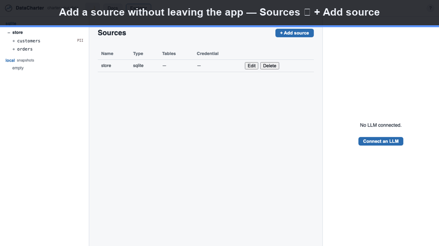

[Home](index.html) &middot; [Quick start](quickstart.html) &middot; [Editor](editor.html) &middot; [charter.yaml](charter-yaml.html) &middot; [Sources](sources.html) &middot; [Agent](agent.html) &middot; [Guides](guides.html) &middot; [Evals](evals.html) &middot; [Audit](audit.html) &middot; [Policies](policies.html) &middot; [CLI](cli.html) &middot; [MCP](mcp.html) &middot; [Workspace](workspace.html) &middot; [Desktop](desktop.html) &middot; [About](about.html) &middot; [FAQ](faq.html)

DataCharter federates every source through one DuckDB engine. Each source type
is registered by one of four mechanisms, and pushdown (sending filters and
projections to where the data lives) behaves accordingly.

## Add a source in the UI

You don't have to hand-edit `charter.yaml`: open **Sources ▸ + Add source**,
give it a name, type, and path (or connection), test the connection, and save.
DataCharter writes the source into `charter.yaml` and registers it live.



## Registration mechanisms

- **ATTACH** &mdash; DuckDB attaches the source as a catalog using a built-in or
  auto-installed extension. Credentials are injected as a temporary secret and
  the catalog is attached read-only.
- **ATTACH (community extension)** &mdash; the same, but the extension is fetched
  from the DuckDB community repository on first use
  (`INSTALL <ext> FROM community; LOAD <ext>`).
- **file-view** &mdash; a view over a DuckDB file reader
  (`read_csv`, `read_parquet`, `read_json`, `read_xlsx`, `iceberg_scan`, `delta_scan`).
  Remote paths (`s3://`, and other object stores) load `httpfs` and use a
  temporary S3-style secret from the source's credentials.
- **connector-extract** &mdash; no reliable ATTACH exists, so a Python connector
  pulls rows into a local DuckDB table. The result is queried exactly like an
  attached source, but it is materialized rather than live-federated.

## The matrix

| Type | Mechanism | Extension / dependency | Pushdown |
| --- | --- | --- | --- |
| `postgres` | ATTACH | `postgres` (bundled) | Native DuckDB filter + projection |
| `mysql` | ATTACH | `mysql` (bundled) | Native DuckDB filter + projection |
| `sqlite` | ATTACH | `sqlite` (bundled) | Native DuckDB filter + projection |
| `duckdb` | ATTACH | core | Native DuckDB filter + projection (attach an existing `.duckdb`/`.db` file, read-only) |
| `bigquery` | ATTACH (community extension) | `bigquery` (auto-installed) | Native DuckDB filter + projection |
| `mssql` | ATTACH (community extension) | `mssql` (auto-installed) | Native DuckDB filter + projection |
| `csv` | file-view | core (`httpfs` for remote) | Column projection; row pruning where the reader supports it |
| `parquet` | file-view | core (`httpfs` for remote) | Column projection + row-group / predicate pruning |
| `json` | file-view | core (`httpfs` for remote) | Column projection |
| `excel` | file-view | `excel` core extension (auto-loaded) | Reads `.xlsx`; column projection |
| `iceberg` | file-view | `iceberg` core extension | Column projection + partition pruning |
| `delta` | file-view | `delta` core extension | Column projection + partition pruning |
| `snowflake` | connector-extract | `datacharter[snowflake]` extra | Connector pushdown planner + aggregation pushdown; **materialized, capped by `max_rows`** |
| `motherduck` | ATTACH (`md:`) | `motherduck` (signed, auto-installed) | Native DuckDB filter + projection over your MotherDuck cloud database, read-only |
| `iceberg_rest` | ATTACH (REST catalog) | `iceberg` core extension | Native DuckDB filter + projection over an Iceberg REST catalog (Polaris / Nessie / Lakekeeper / Unity / Glue / S3 Tables), read-only |

## Pushdown, honestly

**ATTACH and file sources** get their pushdown from DuckDB's own optimizer, for
free. A single-source filter or projection is pushed into the remote scan or the
file reader. This holds even inside a cross-source join: each leg is reduced by
its own pushdown first, then DuckDB performs the join locally. There is no engine
but DuckDB that sees both legs, so a cross-source join itself cannot be pushed
down, but every leg still filters at its source.

**The connector-extract path (Snowflake)** has no DuckDB scanner to push into, so
DataCharter computes the pushdown itself, deterministically, from the query's
syntax tree (no model involved):

- **Projection**: only the columns the query references for that table are
  pulled. Any ambiguity falls back to all columns.
- **Predicates**: top-level `AND` conjuncts that reference exactly one connector
  table with a safe, constant-operand shape (`=`, `<>`, `<`, `>`, `<=`, `>=`,
  `IN`, `IS [NOT] NULL`, `LIKE`) are pushed into the extract SQL. Anything else
  stays local.
- **Aggregation pushdown**: a single-table pure aggregation
  (`count`/`sum`/`avg`/`min`/`max` with bare `GROUP BY` keys, a pushable
  `WHERE`, `ORDER BY` on outputs, and `LIMIT`) is reconstructed and run whole on
  Snowflake, so only the small grouped result crosses the wire instead of a
  large extract.

Pushdown is always a pure optimization: the full `WHERE` re-runs locally in
DuckDB against the materialized rows, so a conservative push (a subset of
predicates, a superset of columns) is always correct. A missed optimization
never changes an answer.

### The Snowflake extract cap

Because Snowflake is materialized rather than streamed, the extract is bounded by
a row cap: `max_rows` in `charter.yaml`, defaulting to 1,000,000. The connector
probes one row past the cap, so if the source held more, the result is flagged
as **truncated**: an amber banner in the UI and a warning in the agent's tool
payload. The cap never fails silently. To pull the complete result set anyway,
raise `max_rows`, narrow your query so pushdown pulls less, or use Export
(`COPY ... TO`), which writes the full result and bypasses the display cap.

## Uniform table names

Every table declared in a source's `tables:` list is exposed as a flat view
named `"<source>__<table>"`, collapsing six different qualification schemes
into one predictable name; dotted `source.table` names always work, listed or
not. A Snowflake connector table reads identically to an attached one at the
query layer. File sources are already a single flat relation named after the
source (for example, `orders`), so they need no alias.

```sql
-- A cross-source join reads the same regardless of where each side lives:
SELECT c.email, sum(o.total) AS spend
FROM warehouse__customers c
JOIN orders o ON o.customer_id = c.id
GROUP BY c.email
ORDER BY spend DESC;
```

Declaring one is a few lines of `charter.yaml` — for example:

```yaml
sources:
  warehouse:
    type: postgres
    connection: { host: db.internal, database: analytics, user: readonly }
    credentials:
      password: ${WAREHOUSE_PASSWORD}
    tables: [customers, orders]

  events:
    type: parquet
    path: s3://lake/events/*.parquet
    credentials:
      key_id: ${AWS_KEY_ID}
      secret: ${AWS_SECRET}
```

Every field, per type, is in the [charter.yaml reference](charter-yaml.html).

## Iceberg REST catalogs, and where the data lives

An `iceberg_rest` source attaches a whole catalog — Polaris, Nessie, Lakekeeper,
Unity, AWS Glue, or S3 Tables — and exposes its tables as
`<source>.<namespace>.<table>`. Two kinds of credential are in play, and they are
not the same thing:

- **Catalog auth** — how DataCharter talks to the REST catalog. A bearer `token`,
  an OAuth2 `client_id`/`client_secret`, or (for Glue / S3 Tables) AWS
  `key_id`/`secret`/`region`. This is what your `credentials` block sets. A
  dev/local catalog with no auth needs `connection.authorization_type: none`.
- **Storage access** — how the query engine reads the underlying data files. Most
  managed catalogs (Polaris, Unity, Lakekeeper, Glue) **vend** short-lived
  storage credentials, so nothing more is needed. For a catalog that does *not*
  vend, DataCharter reads the files with the standard cloud credentials from your
  environment (the S3/GCS/Azure credential chain); a custom object store (MinIO
  or another non-AWS endpoint) additionally needs that endpoint configured for
  DuckDB. This split is inherent to Iceberg REST, not specific to DataCharter.

Governance is unchanged either way: the catalog is attached `READ_ONLY`, and PII
you declare on its tables is masked on the agent surface exactly as for any other
source.

Next: [Connect an agent →](agent.html)
