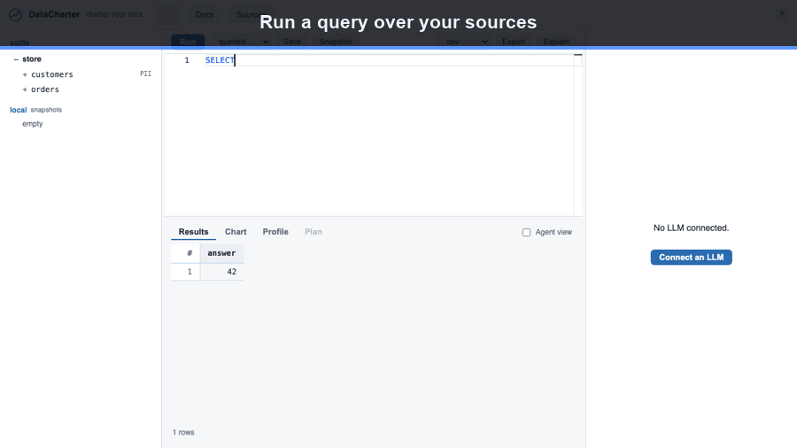

[Home](index.html) &middot; [Quick start](quickstart.html) &middot; [Editor](editor.html) &middot; [charter.yaml](charter-yaml.html) &middot; [Sources](sources.html) &middot; [Agent](agent.html) &middot; [Guides](guides.html) &middot; [Evals](evals.html) &middot; [Audit](audit.html) &middot; [Policies](policies.html) &middot; [CLI](cli.html) &middot; [MCP](mcp.html) &middot; [Workspace](workspace.html) &middot; [Desktop](desktop.html) &middot; [About](about.html) &middot; [FAQ](faq.html)


# The workspace

A DataCharter workspace is just a directory. Everything that describes your
exploration environment lives in files you can read, diff, commit, and share —
and nothing secret or machine-specific travels with them.

## What's in it

```
my-workspace/
  charter.yaml        # sources, tables, PII fields — your catalog as a contract
  queries/*.sql       # saved queries (the Query Files panel reads/writes these)
  .env.example        # placeholder secret names, committed
  .env                # real secrets — git-ignored, never committed
  .datacharter/       # local state (cache, snapshots, temp) — git-ignored
```

`datacharter init` scaffolds the committable parts; `datacharter init --demo`
adds a small generated dataset so you can try everything immediately.

## Snapshots — save a result as a local table

Run a query, click **Snapshot**, and the result is saved as `local.<name>` —
a reusable table kept in `.datacharter/` on your machine. Query it like any
other relation; `datacharter recheck <name>` re-runs its SQL and diffs against
the saved copy. To remove a snapshot (or a table you dragged in) later, click the
**✕** next to it in the source tree.



## Portable by construction

- **Commit `charter.yaml` + `queries/` + `.env.example`** and your teammates get
  the same sources and saved queries with a `git clone` + `datacharter serve`.
- **Secrets never travel.** `charter.yaml` only references `${NAME}`; the real
  values live in `.env` or your OS keyring, both outside version control.
- **Local state never travels.** `.datacharter/` (cache, history, snapshots,
  encrypted spill) is git-ignored and re-created per machine.
- **Paths stay relative.** The loader warns on absolute or Windows-style paths
  so a workspace relocates cleanly across machines and operating systems.

The result: your team's whole data-exploration setup is a repo. Clone it, run
it, and you're looking at the same sources — while credentials and local state
stay on each person's own machine.
